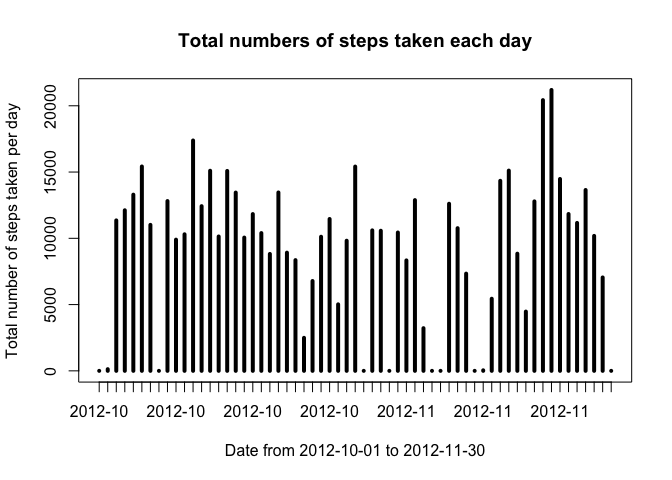
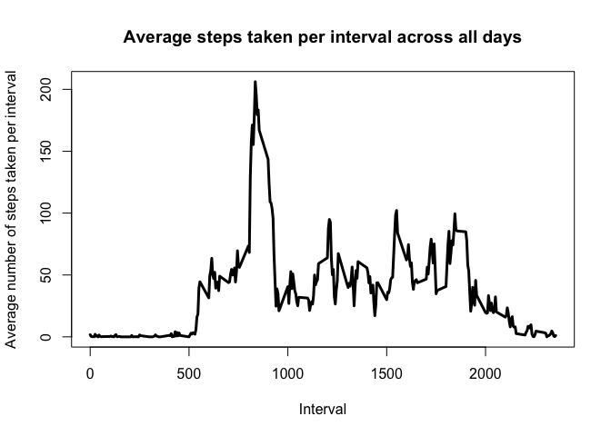

# Reproducible Research: Peer Assessment 1
QIAO Yuchen  


## Loading and preprocessing the data
Firsly ,let's read the data in the csv file and check the data. I read the file into a data.frame and I also need to make the date column into right type. 

```r
# read the data into a data.framework
data <- read.csv(file = "activity.csv", sep = ",", dec = ".", header = TRUE)
# check the date colum into right type
data[, 2] <- as.Date(data[, 2], format = "%Y-%m-%d")
# show the header of the processed data
str(data)
```

```
## 'data.frame':	17568 obs. of  3 variables:
##  $ steps   : int  NA NA NA NA NA NA NA NA NA NA ...
##  $ date    : Date, format: "2012-10-01" "2012-10-01" ...
##  $ interval: int  0 5 10 15 20 25 30 35 40 45 ...
```

```r
head(data)
```

```
##   steps       date interval
## 1    NA 2012-10-01        0
## 2    NA 2012-10-01        5
## 3    NA 2012-10-01       10
## 4    NA 2012-10-01       15
## 5    NA 2012-10-01       20
## 6    NA 2012-10-01       25
```

## What is mean total number of steps taken per day?
In this part, a histograms is provided to answer the question in the directions. This histogram will show the total number of the steps taken each day. The mean and median of the total number of steps taken per day are also calculated in the R code.


```r
# calculation of the total of steps taken each unique day
uniqueDays <- unique(data$date)
uniqueDays
```

```
##  [1] "2012-10-01" "2012-10-02" "2012-10-03" "2012-10-04" "2012-10-05"
##  [6] "2012-10-06" "2012-10-07" "2012-10-08" "2012-10-09" "2012-10-10"
## [11] "2012-10-11" "2012-10-12" "2012-10-13" "2012-10-14" "2012-10-15"
## [16] "2012-10-16" "2012-10-17" "2012-10-18" "2012-10-19" "2012-10-20"
## [21] "2012-10-21" "2012-10-22" "2012-10-23" "2012-10-24" "2012-10-25"
## [26] "2012-10-26" "2012-10-27" "2012-10-28" "2012-10-29" "2012-10-30"
## [31] "2012-10-31" "2012-11-01" "2012-11-02" "2012-11-03" "2012-11-04"
## [36] "2012-11-05" "2012-11-06" "2012-11-07" "2012-11-08" "2012-11-09"
## [41] "2012-11-10" "2012-11-11" "2012-11-12" "2012-11-13" "2012-11-14"
## [46] "2012-11-15" "2012-11-16" "2012-11-17" "2012-11-18" "2012-11-19"
## [51] "2012-11-20" "2012-11-21" "2012-11-22" "2012-11-23" "2012-11-24"
## [56] "2012-11-25" "2012-11-26" "2012-11-27" "2012-11-28" "2012-11-29"
## [61] "2012-11-30"
```

```r
totalStepsPerDay <- tapply(data$steps, data$date, FUN=sum, na.rm = TRUE)
totalStepsPerDay
```

```
## 2012-10-01 2012-10-02 2012-10-03 2012-10-04 2012-10-05 2012-10-06 
##          0        126      11352      12116      13294      15420 
## 2012-10-07 2012-10-08 2012-10-09 2012-10-10 2012-10-11 2012-10-12 
##      11015          0      12811       9900      10304      17382 
## 2012-10-13 2012-10-14 2012-10-15 2012-10-16 2012-10-17 2012-10-18 
##      12426      15098      10139      15084      13452      10056 
## 2012-10-19 2012-10-20 2012-10-21 2012-10-22 2012-10-23 2012-10-24 
##      11829      10395       8821      13460       8918       8355 
## 2012-10-25 2012-10-26 2012-10-27 2012-10-28 2012-10-29 2012-10-30 
##       2492       6778      10119      11458       5018       9819 
## 2012-10-31 2012-11-01 2012-11-02 2012-11-03 2012-11-04 2012-11-05 
##      15414          0      10600      10571          0      10439 
## 2012-11-06 2012-11-07 2012-11-08 2012-11-09 2012-11-10 2012-11-11 
##       8334      12883       3219          0          0      12608 
## 2012-11-12 2012-11-13 2012-11-14 2012-11-15 2012-11-16 2012-11-17 
##      10765       7336          0         41       5441      14339 
## 2012-11-18 2012-11-19 2012-11-20 2012-11-21 2012-11-22 2012-11-23 
##      15110       8841       4472      12787      20427      21194 
## 2012-11-24 2012-11-25 2012-11-26 2012-11-27 2012-11-28 2012-11-29 
##      14478      11834      11162      13646      10183       7047 
## 2012-11-30 
##          0
```

```r
# draw the plot of the histogram
with(data, plot(uniqueDays, totalStepsPerDay, type="h", main = "Total numbers of steps taken each day", xlab = "Date from 2012-10-01 to 2012-11-30", ylab = "Total number of steps taken per day", lwd = 4, xaxt = "n"))
axis.Date(1, at = seq(min(data$date), max(data$date), by = "1 day"), format = "%Y-%m")
```

 

```r
# mean of the total number of steps taken per day
mean(totalStepsPerDay)
```

```
## [1] 9354.23
```

```r
# median of the total number of steps taken per day
median(totalStepsPerDay)
```

```
## [1] 10395
```

## What is the average daily activity pattern?
In this part, 

```r
#stepsPerInterval <- aggregate(formula = steps ~ interval, data = data, FUN = mean, na.rm = TRUE)
#plot(stepsPerInterval$interval, stepsPerInterval$steps, type = "l", lwd = 4, main = "", xlab = "", ylab = "")
stepsPerInterval <- tapply(data$steps, data$interval, FUN = mean, na.rm = TRUE)
uniqueInterval <- unique(data$interval)
plot(uniqueInterval, stepsPerInterval, type = "l", lwd = 3, main = "Average steps taken per interval across all days", xlab = "Interval", ylab = "Average number of steps taken per interval")
```

 

```r
# The interval with maximum of steps and the maximum are shown below
stepsPerInterval[which.max(stepsPerInterval)]
```

```
##      835 
## 206.1698
```

## Imputing missing values


## Are there differences in activity patterns between weekdays and weekends?
